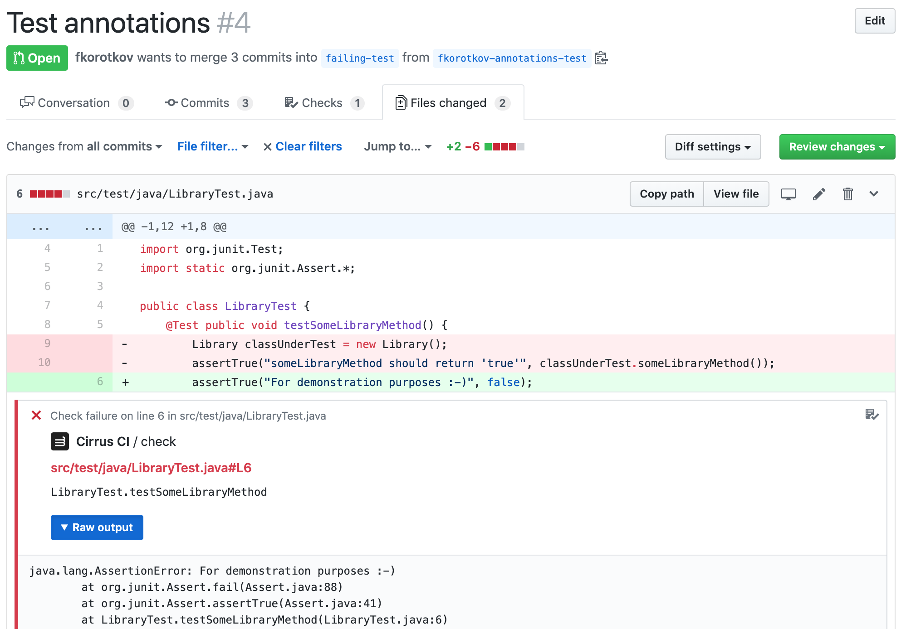

# Cirrus CI Annotations Parser

[](https://cirrus-ci.com/github/cirruslabs/cirrus-ci-annotations)

This module helps Cirrus CI to parse artifacts and find relative annotations to report in GitHub UI.



# Supported Formats

* JUnit's XML
* [GolangCI Lint](https://golangci-lint.run/)
* [Android Lint](https://sites.google.com/a/android.com/tools/tips/lint)
* Ruby
  * [RSpec](https://rspec.info/)
  * [RuboCop](https://rubocop.org/)
* Swift
  * [XCLogParser](https://github.com/spotify/XCLogParser)
* [JetBrains Qodana](https://github.com/JetBrains/Qodana)
* [ESLint](https://eslint.org/)

[Create an issue](https://github.com/cirruslabs/cirrus-ci-annotations/issues/new) to request support for other formats.

# Cirrus Annotation Format

For tools that don't yet have their own annotation format, or for those that are wishing to simplify the integration process (to avoid adding a new parser), there's a simple streamed format they can use.

All you need to do is to emit JSON objects, [one per line](https://en.wikipedia.org/wiki/JSON_streaming#Line-delimited_JSON), where each describes a repository's file and what's gone wrong with it.

Here's an example:

```json
{"level": "warning", "message": "use of os.SEEK_START is deprecated", "path": "main.go", "start_line": 35, "end_line": 35}
{"level": "failure", "message": "TestMain() failed!", "raw_details":  "main_test.go:18: expected a non-nil return", "path": "main_test.go", "start_line": 18, "end_line": 18}
```

Required fields:

* `level` — describes the severity of the annotation and results in different web UI rendering and build failure behavior
  * can be either `notice`, `warning` or `failure`
* `message` — a short description of what's gone wrong
* `path` — points to a file with the issue, relative to the repository's root
* `start_line` and `end_line` — the range of lines in `path` where the issue has happened
  * if your tool can only generate the information about a single line — simply set them both to that value

Optional fields:

* `raw_details` — an extension to the `message` that will be rendered as code and thus can contain multiple lines
* `start_column` and `end_column` — used to specify a more precise range than just using `start_line` and `end_line`

# Contribution

Contributions are always welcome! 🎉🙌
